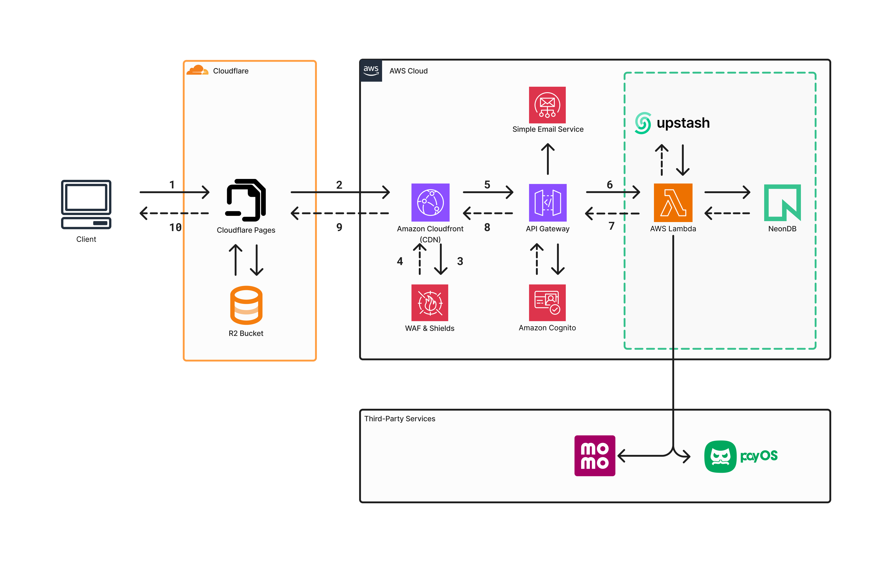

# BasicSocialMedia

BasicSocialMedia is a monolith social media backend built with ASP.NET Core 8. It handles authentication, user profiles, follows, direct chats, messages, media uploads, JWT sessions, Redis-backed token validation, and real-time SignalR hubs.

The application is designed as one deployable API, with layered projects inside the solution for API, application logic, infrastructure, and domain models.

## Architecture



Production architecture:

- **Client** is served through Cloudflare Pages.
- **Static assets / uploaded objects** are stored in Cloudflare R2.
- **CloudFront + WAF & Shield** sit in front of the API edge.
- **API Gateway** routes requests into the backend.
- **AWS Lambda** hosts the monolith API.
- **NeonDB** provides managed PostgreSQL.
- **Amazon Cognito** is part of the auth boundary in the cloud design.
- **Amazon SES** is used for email delivery in the cloud design.
- **MoMo / PayOS** are third-party payment integrations.

Local development uses Docker Compose for PostgreSQL and Redis. The current codebase also contains a Cloudinary media service implementation.

## Tech Stack

- **.NET 8 / ASP.NET Core Web API**
- **Entity Framework Core**
- **PostgreSQL / NeonDB**
- **Redis**
- **SignalR**
- **JWT authentication**
- **FluentValidation**
- **AutoMapper**
- **Swagger / OpenAPI**
- **AWS Lambda + API Gateway**
- **Cloudflare Pages + R2**

## Project Structure

```text
BasicSocialMedia.API/             HTTP API, auth setup, middleware, controllers, SignalR hubs
BasicSocialMedia.Application/     DTOs, services, contracts, mapping, shared results
BasicSocialMedia.Domain/          Entities and enums
BasicSocialMedia.Infrastructure/  EF Core DbContext, repositories, Redis, encryption, migrations
docs/                             Architecture documentation
```

## Features

- Register, login, logout
- JWT access and refresh token flow
- Redis-backed active session validation
- User profile lookup and profile picture upload
- Follow, unfollow, and follow-status APIs
- Direct message chats and messages
- SignalR hubs for messages and notifications
- Global exception handling
- Basic rate limiting and performance logging middleware
- Swagger UI in development

## Getting Started

### Prerequisites

- .NET SDK 8
- Docker Desktop

### Run Dependencies

```bash
docker compose up -d
```

This starts:

- PostgreSQL on `localhost:5432`
- Redis on `localhost:6379`

### Configure Secrets

Update `BasicSocialMedia.API/appsettings.json` or use user secrets/environment variables for:

- `ConnectionStrings:DefaultConnection`
- `ConnectionStrings:Redis`
- `JwtSettings:SecretKey`
- `EncryptionSettings:AesKey`
- `CloudinarySetting:*`

`JwtSettings:SecretKey` must be at least 32 bytes.

### Apply Database Migrations

```bash
dotnet ef database update --project BasicSocialMedia.Infrastructure --startup-project BasicSocialMedia.API
```

### Run The API

```bash
dotnet run --project BasicSocialMedia.API
```

Development URLs:

- API: `http://localhost:5148`
- Swagger: `http://localhost:5148/swagger`
- Health check: `http://localhost:5148/healthchecks`

## API Surface

Main controller groups:

- `api/Auth`
- `api/User`
- `api/Follow`
- `api/DirectMessageChat`
- `api/Message`

SignalR hubs:

- `/hub/messageHub`
- `/hub/notificationHub`

## Notes

This repository is intentionally kept as a monolith: one deployable API, one database boundary, and simple internal project layering. Split services only when deployment, scaling, or ownership pressure proves the monolith is no longer enough.
